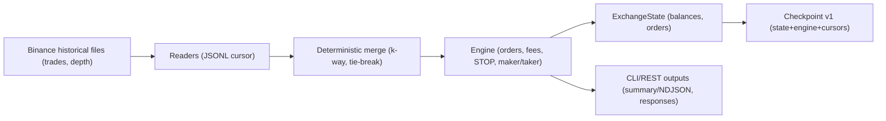

# TradeForge Guide

## Архитектура пакетов

- **`@tradeforge/core`** — движок симуляции. Содержит службы работы со счетами (`AccountsService`), ордерами (`OrdersService`), движок матчинга и модель комиссий. Управляет временной шкалой, выполняет `runReplay` и предоставляет API для создания/загрузки чекпоинтов.
- **`@tradeforge/io-binance`** — набор ридеров исторических данных Binance. Поддерживает CSV/JSON/JSONL, умеет нормализовать поля в формат, понятный `core`, и предоставляет курсоры (`createJsonlCursorReader`) для возобновляемых прогонов.
- **`@tradeforge/cli`** — консольный инструмент, собирающий pipeline из ридеров и движка. Реализует команду `tf simulate`, управление часами, авто-чекпоинты и вывод статистики.
- **`@tradeforge/svc`** — REST-обёртка над движком. Поднимает Fastify-сервер с маршрутами для управления счетами и ордерами и использует те же сервисы `core` в памяти.

Компоненты связаны минимальным числом зависимостей: CLI и сервис подключают `core` напрямую и опционально используют `io-binance` для чтения исторических данных.

## Поток данных симуляции



Диаграмма отражает conservative execution model (MVP-1), где исполнение идёт только по TRADES. В будущих версиях появится режим full-conformance, учитывающий влияние ордеров на поток и глубину ордербука.

- **Binance historical files** — исходные сделки и стаканы Binance (обычно `*.jsonl`), которые выступают единым источником правды.
- **Readers** — адаптеры `@tradeforge/io-binance`, формирующие восстановимые JSONL-стримы с курсорами.
- **Deterministic merge** — объединитель событий `createMergedStream`, решающий конфликты по типу и тай-брейку.
- **Engine** — движок `@tradeforge/core`, который матчит ордера, рассчитывает комиссии и исполняет STOP-логики.
- **ExchangeState** — хранилище балансов, ордеров и сервисных структур, обновляемое движком.
- **Checkpoint v1** — снимок состояния и курсоров, позволяющий возобновить прогон с того же места.
- **CLI/REST outputs** — отчёты `tf simulate` (`--summary`/`--ndjson`) и ответы REST-сервиса, построенные на данных движка.

## Консервативная модель исполнения

MVP-1 придерживается консервативного подхода: симулятор матчит ордера **только** по фактическим сделкам (`TradeEvent`). Данные стакана (`DepthDiff`) используются для тай-брейков и контроля последовательности, но не создают дополнительной ликвидности.

Ключевые правила:

- Лимитные ордера исполняются лишь тогда, когда цена сделки удовлетворяет условию (`BUY` при `trade.price <= limit`, `SELL` при `trade.price >= limit`). Без подтверждающей сделки позиция не изменится.
- Комиссии рассчитываются через `CommissionModel` и распределяются по ролям maker/taker на основе источника агрессии в событии `Trade`.
- Стоп-ордера (`STOP_LIMIT`, `STOP_MARKET`) проверяют `triggerPrice` при каждом событии сделки: триггер активируется, если цена пересекает порог в выбранном направлении (`UP`/`DOWN`). После активации применяются стандартные правила исполнения.
- Данные стакана влияют только на порядок обработки, например, когда у depth и trades одинаковые метки времени.

Соответствующие флаги CLI:

- `--treat-limit-as-maker` (включён по умолчанию) позволяет считать наши лимитные ордера поставщиками ликвидности, если они не противоречат агрессору.
- `--strict-conservative` устанавливает коэффициент участия в 0, тем самым отключая исполнение в пограничных ситуациях.
- `--use-aggressor-liquidity` вручную включает более агрессивный режим, когда объём агрессора допускается как источник ликвидности.

## Детерминизм и таймлайн

Чтобы добиться повторяемости, движок фиксирует каждое место, где мог бы возникнуть недетерминизм:

- Потоки сделок и стакана объединяются в `createMergedStream` с детерминированным порядком разрешения конфликтов. По умолчанию при совпадении меток времени приоритет у стакана (`DEPTH`), но флаг `--prefer-depth-on-equal-ts=false` позволяет отдать приоритет сделкам (`TRADES`). Выбранное значение попадает в чекпоинт (`nextSourceOnEqualTs`).
- При одинаковой метке и типе события дальше используется стабильный порядок обхода входных файлов и индексов в файле: JSONL-ридер сортирует имена и позиции внутри `.gz`/`.zip` архивов.
- Все денежные величины хранятся как `bigint`. При сериализации (чекпоинты, REST, CLI) значения переводятся в строки — это исключает расхождения из-за плавающей запятой.
- Контролируется монотонность меток времени (`assertMonotonicTimestamps`), а метаданные таймлайна (`logical`, `wall`, `accel`) записываются в итоговую статистику, что помогает воспроизвести прогон.

## Ограничения форматов и курсоров

- `createReader` поддерживает `csv`, `json`, `jsonl` и авто-детект по расширению. Однако курсоры (`CheckpointV1`) гарантированно работают **только** с JSON Lines: `*.jsonl`, `*.jsonl.gz` и `*.jsonl.zip` c ровно одним вложенным `*.jsonl` файлом.
- При использовании CSV/JSON поток можно воспроизвести, но позицию восстановить нельзя — чекпоинт сохранит состояние движка, а входные данные придётся переигрывать с начала.
- JSONL-ридер сортирует список файлов и архивов, проверяет монотонность меток и записывает точный offset. Эти данные используются при возобновлении, поэтому любые изменения структуры архива делают курсор недействительным.

## Checkpoint v1

Чекпоинт (`CheckpointV1`) содержит:

- `meta` — символ и, опционально, заметку пользователя.
- `engine` и `state` — сериализованные снимки движка и публичного состояния `ExchangeState`.
- `cursors` — позиция в потоках сделок/стакана (файл, entry, индекс записи). Для не-JSONL источников курсоры отсутствуют.
- `merge.nextSourceOnEqualTs` — правило тай-брейка, с которым была создана симуляция.

### Создание

CLI автоматически строит чекпоинт при указании `--checkpoint-save`. Можно задать интервалы автосохранения по событиям (`--cp-interval-events`) или реальному времени (`--cp-interval-wall-ms`). При отсутствии интервалов чекпоинт сохраняется только по завершении прогона. Успешное сохранение сопровождается сообщением `checkpoint saved to …`.

### Загрузка

`--checkpoint-load` восстанавливает состояние движка и применяет курсоры. Необходимо передать те же входные файлы, что использовались ранее, чтобы курсоры совпали: JSONL-ридер ищет файл по имени и entry внутри архива. Если курсор найден, симуляция продолжится с нужной строки; иначе будет выброшено исключение.

### Пример CLI-команды

```bash
pnpm --filter @tradeforge/cli exec -- \
  tf simulate \
  --trades data/trades.jsonl \
  --checkpoint-load checkpoints/btcusdt.json \
  --summary
```

Чекпоинт лежит в JSON, где `bigint` сериализованы строками. При возобновлении можно изменять параметры вывода (например, включать `--ndjson`), но состав входных источников должен совпадать с моментом сохранения.

### Ограничения

- В версии v1 гарантируются только JSONL-источники. Поддержка CSV/JSON и многофайловых архивов запланирована на будущие релизы.
- При изменении порядка файлов или их содержимого курсор станет недействительным.

## Типовой user-flow

1. **Подготовка данных** — выгрузить сделки/стакан Binance и преобразовать в JSONL (или воспользоваться `@tradeforge/io-binance` для конвертации).
2. **Первый прогон** — запустить `tf simulate` с `--checkpoint-save`, указав входные файлы и желаемые интервалы автосохранения.
3. **Автосохранение** — дождаться сообщения `checkpoint saved to …` и остановить процесс (Ctrl+C), если нужно перенести расчёт.
4. **Возобновление** — запустить `tf simulate --checkpoint-load <файл>` с теми же `--trades`/`--depth`, чтобы продолжить симуляцию.
5. **Интеграция с REST** — при необходимости поднять `@tradeforge/svc` и отдавать полученные отчёты через HTTP, используя формат строк для чисел.

Такой процесс обеспечивает детерминизм: при неизменных данных и настройках симулятор даёт идентичные результаты, а чекпоинты позволяют разделять длительные прогоны на несколько сессий.
