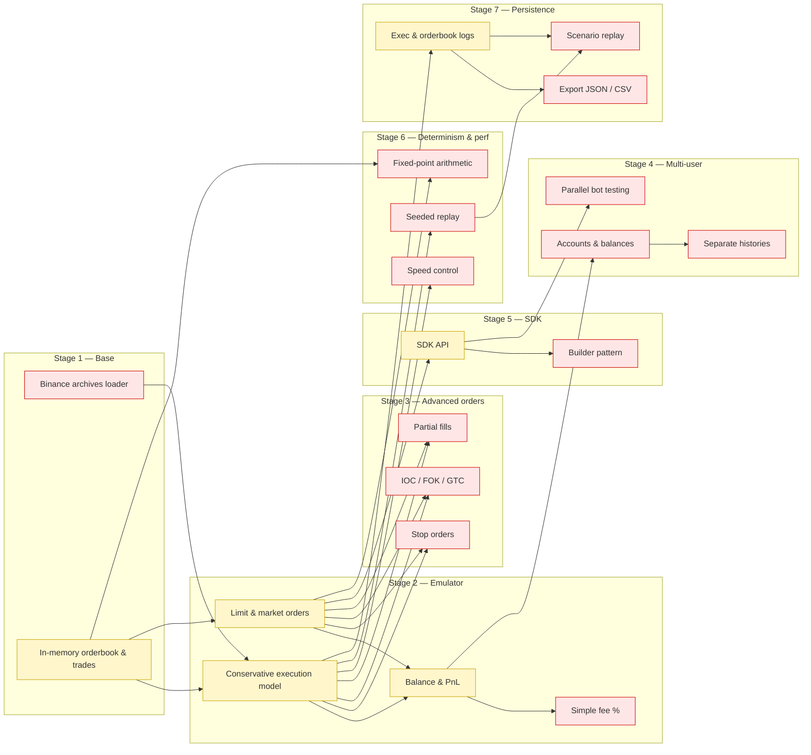

## 🚀 Дорожная карта TradeForge v1 (фактическая)

### Этап 1. Базовая инфраструктура — ✅ выполнен

- [x] Каркас проекта (TypeScript, Node.js)
- [x] Тестовая среда (Jest или аналог)
- [ ] Загрузка архивов Binance Data Portal (BTCUSDT trades + L2 diff depth)
- [~] Простая структура данных в памяти (ордербук + список сделок)

---

### Этап 2. Эмулятор рынка — 🟡 частично

- [~] Консервативная модель исполнения ордеров  
  (ордер исполняется, только если исторические сделки перекрывают цену)
- [~] Поддержка лимитных и рыночных ордеров
- [~] Баланс и PnL-учёт (без плеча)
- [ ] Простая комиссия (фиксированный %)

---

### Этап 3. Расширенные ордера — ❌ не реализован

- [ ] Стоп-ордера (stop-market, stop-limit)
- [ ] IOC/FOK/GTC (политики исполнения)
- [ ] Частичное исполнение ордеров

---

### Этап 4. Многопользовательский режим — ❌ не реализован

- [ ] Отдельные аккаунты и балансы
- [ ] Независимая история сделок и ордеров
- [ ] Параллельное тестирование нескольких ботов

---

### Этап 5. SDK (TypeScript) — 🟡 частично

- [~] API для управления песочницей  
  (`createSandbox()`, `placeOrder()`, `cancelOrder()`, `getBalance()`)
- [ ] Builder-паттерн настройки песочницы
- [x] Интеграционные примеры: простые боты (например, random-trader)

---

### Этап 6. Детерминизм и производительность — ❌ не реализован

- [ ] Фикс-поинт арифметика (целые числа для цен/количеств)
- [ ] Настраиваемая скорость прогона (реальное время, x2, «максимально быстро»)
- [ ] Реплей с фиксированным seed и жёсткой синхронизацией событий

---

### Этап 7. Сохранение данных — 🟡 частично

- [ ] Экспорт результатов прогона (JSON/CSV)
- [~] Логи исполнений и состояния ордербука
- [ ] Возможность «переиграть» сценарий с теми же настройками

Коротко, что можно тянуть параллельно уже сейчас:

* **S1D (загрузчик Binance)** и **S1O (ордербук)** — независимы, можно вести двумя потоками.
* На базе **S1O** — параллелить **S2E** и **S2ML** (две команды на исполнение и поддержку типов ордеров).
* После появления базового исполнения (**S2E/S2ML**) разделить работу:
  — **S2P (PnL/баланс)** → затем **S2F (комиссия)**,
  — **S7L (логи)** → потом **S7E (экспорт)** и **S7RS (реплей сценариев)**,
  — **S5A (SDK API)** → затем **S5B (builder)**.
* **S6FP (fixed-point)** можно начинать после стабилизации интерфейсов ордербука и базовых ордеров (S1O + S2ML), не дожидаясь расширенных ордеров.
* **S6V/S6R (скорость и seeded-replay)** — поверх базового цикла симуляции (S2E).
